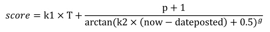
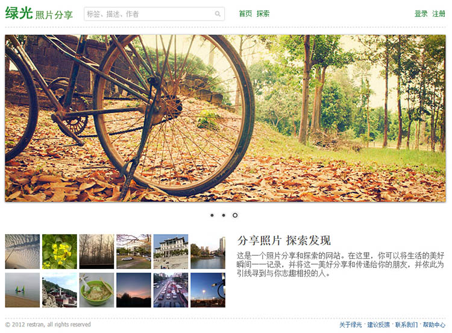
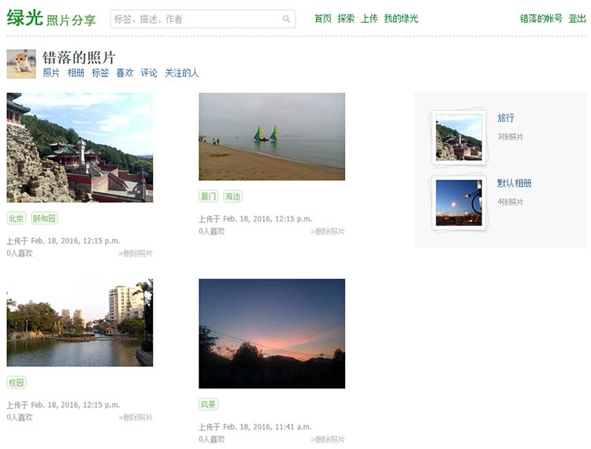
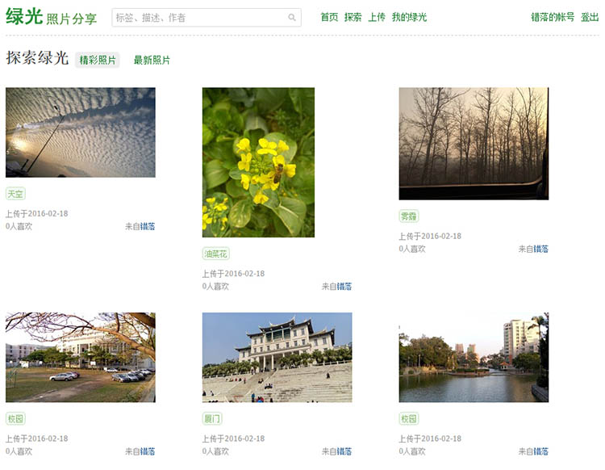
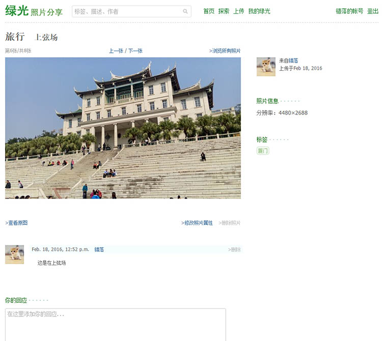

绿光照片分享
=======

这是我2012年的一个课程作业，实现的功能是照片分享，正好以这个作业学习了 Django 和 Web 开发。当时特别喜欢豆瓣、又拍和 Flickr，所以几乎是模仿这几个网站的方式，完成了整个网站。

当时还有许多未完成的功能：

1. 注册邮件验证，找回密码；
2. 验证码；
3. ...

## 环境及依赖

这个网站使用 python 2.7 开发，其他版本没有测试过。django 使用最新版的话会出错，所以需要指定版本。推荐使用 [virtualenv](https://virtualenv.readthedocs.org/) 来搭建环境。

    django==1.2.7
    pillow
    qiniu==6.1.4

## 配置

如果部署网站，需要做如下配置

```py
# 图片存储在七牛上，需要配置七牛的帐号
qiniu.conf.ACCESS_KEY = "123"
qiniu.conf.SECRET_KEY = "456"

# 存在七牛上的图片的文件名前缀
QINIU_FILE_PREFIX = 'grnglow'
# 七牛图片存储的 URL
QINIU_IMG_URL = 'http://your-domain.qiniudn.com/'
# 主页的URL
HOME_PAGE_URL = 'http://127.0.0.1:8000/'
```

数据库默认使用 SQLite，可以修改成 MySQL

```py
DATABASES = {
    'default': {
        'ENGINE': 'django.db.backends.sqlite3',
        'NAME': os.path.join(PROJECT_PATH, 'db.sqlite3'),
    }
}
```

在运行网站前，需要先建表，可以执行

```py
python manage.py syncdb
```

## 热门图片排序

其中计算照片的精彩程度是通过喜欢来进行投票的。为了不使一张照片长期占据排名的前面部分，在计算照片的得分时考虑了现在的时间与照片上传时间的差值，使得后上传的照片可以有机会排到前面。

当时看了几篇基于用户投票的排序算法：

1. [基于用户投票的排名算法（一）：Delicious和Hacker News](http://www.ruanyifeng.com/blog/2012/02/ranking_algorithm_hacker_news.html)
2. [基于用户投票的排名算法（二）：Reddit](http://www.ruanyifeng.com/blog/2012/03/ranking_algorithm_reddit.html)
3. [基于用户投票的排名算法（三）：Stack Overflow](http://www.ruanyifeng.com/blog/2012/03/ranking_algorithm_stack_overflow.html)
4. [基于用户投票的排名算法（四）：牛顿冷却定律](http://www.ruanyifeng.com/blog/2012/03/ranking_algorithm_newton_s_law_of_cooling.html)
5. [基于用户投票的排名算法（五）：威尔逊区间](http://www.ruanyifeng.com/blog/2012/03/ranking_algorithm_wilson_score_interval.html)
6. [基于用户投票的排名算法（六）：贝叶斯平均](http://www.ruanyifeng.com/blog/2012/03/ranking_algorithm_bayesian_average.html)

为了简单起见，不用后台一个程序计算排名。参照这些算法简化了一下，计算公式如下：



其中k1和k2是系数，T是当前时间据某个系统设置的初始时间的差。由于得分采用的是发生喜欢操作时，计算一次得分。因此，为每个得分都加上一个随时间增长的分数增量，使得后上传的照片获得更高的分数。g是照片得分的下降指数，大于1，可以使得新上传的照片下降的速度慢一点，老照片会下降的快一点。由于arctan(0)等于0，因此加上系数0.5，避免除以0。由于用户上传照片时喜欢数为0，因此加上1，表示用户为自己的照片投票。

```py
def calculateScore(self):
    begin_time = datetime.datetime(2012, 1, 1, 0, 0, 0)
    time_offset1 = datetime.datetime.now() - begin_time
    time_offset2 = datetime.datetime.now() - self.date_posted
    minutes1 = (time_offset1.days * 24 * 60) + time_offset1.seconds / 60
    minutes2 = (time_offset2.days * 24 * 60) + time_offset2.seconds / 60
    self.score = minutes1 / 120.0 + (self.like_count + 1) / (math.atan(minutes2 / 240.0 + 0.5) ** 2.2)
```

## 网站效果图

### 首页



----------

### 个人主页



---------

### 探索页面



------

### 照片详细页面


